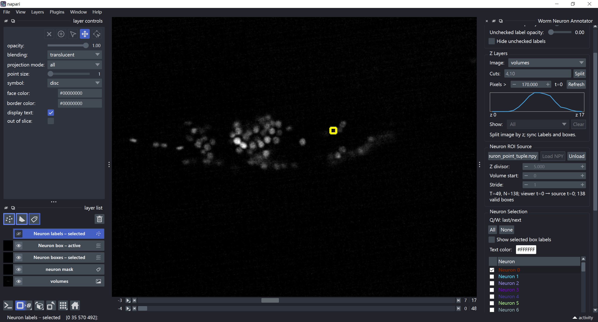
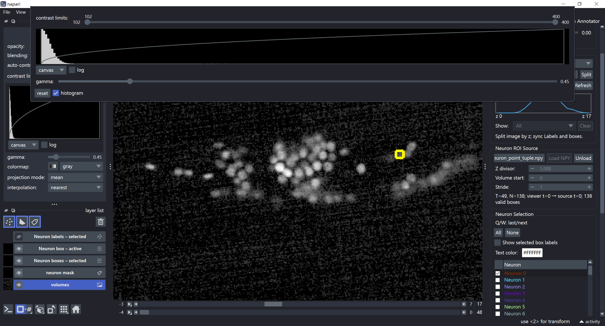
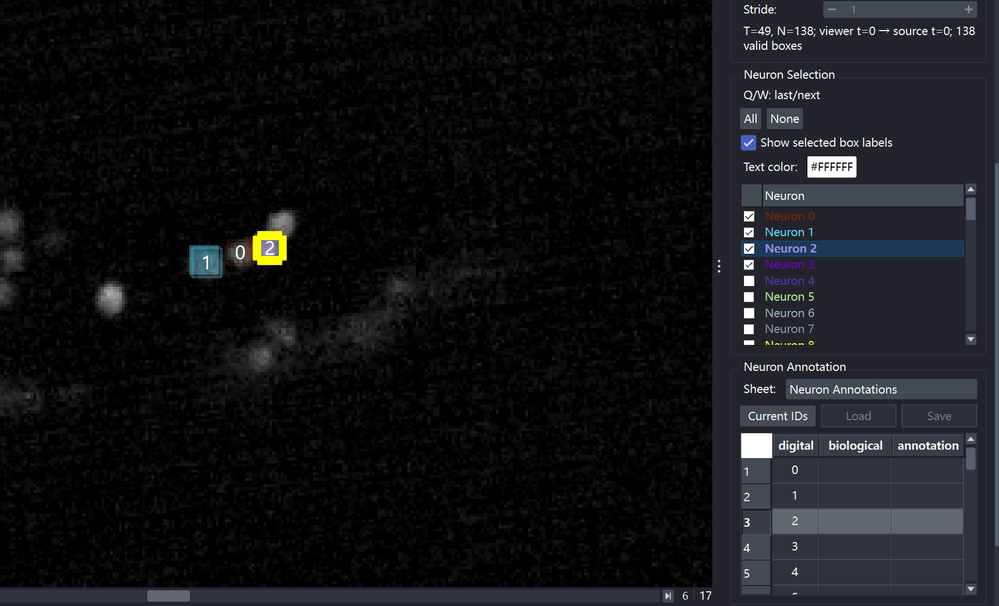
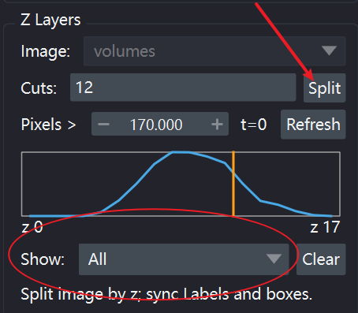
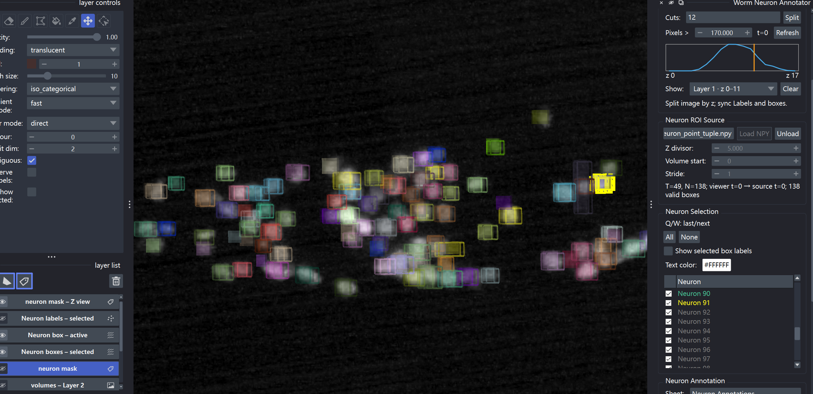
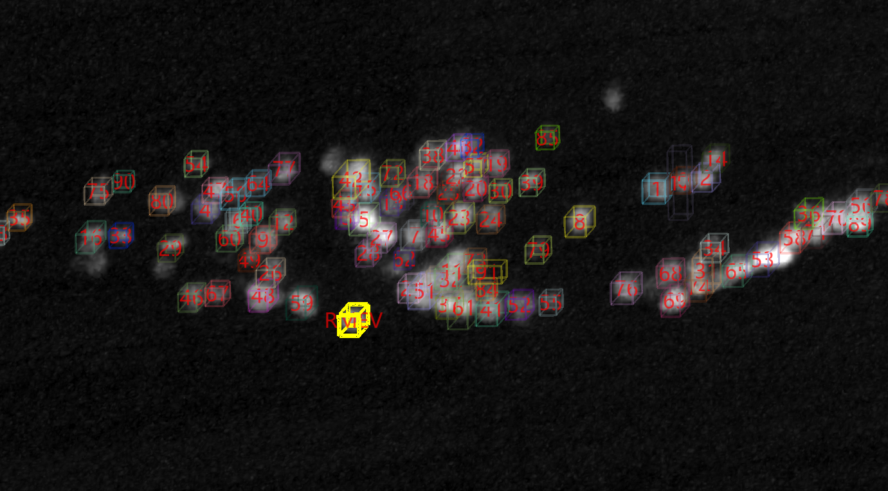

# Worm Neuron Annotator Usage Guide

This repository provides a reproducible launcher for opening compatible volumetric imaging datasets with napari plugin [`napari-worm-neuron-annotator`](https://pypi.org/project/napari-worm-neuron-annotator/). It loads an Image array and read-only neuron bounding-box ROIs, optionally adds a compatible Labels overlay, then opens the annotator directly in napari.

The launcher script `launch_datasets.py` creates and docks the plugin automatically, so the plugin does not need to be opened manually from napari's **Plugins** menu.

## Interface preview



## Prerequisites

- [Pixi](https://pixi.sh/latest/installation/). Pixi installs the locked Python, napari, Qt, plugin, TIFF, HDF5, and Dask dependencies.
- One data source: either a prepared NPY dataset or the original TIFF data plus one ROI source. The ROI source can be a `dynamics.h5` file or a realtime-results directory containing `volume_XXXXXXXX.h5` files. The Labels file is optional in both cases.

A prepared dataset has this layout:

```text
dataset/
├── volumes.npy
├── neuron_point_tuple.npy # optional for image-only viewing
└── neuron_mask.npy       # optional
```

| File                     | Expected content                                                                                                                                              |
| ------------------------ | ------------------------------------------------------------------------------------------------------------------------------------------------------------- |
| `volumes.npy`            | Image array with shape `(T, Z, Y, X)`. The bundled exporter writes `float32`.                                                                                  |
| `neuron_point_tuple.npy` | ROI array with shape `(T, N, K)`, where `K >= 6`. The first six fields are `x`, `y`, `z_scaled`, `width`, `height`, and `depth_scaled`; the exporter writes `float32`. |
| `neuron_mask.npy`        | Optional integer Labels array with the same `(T, Z, Y, X)` shape as `volumes.npy`; the exporter writes `int16`, with `label_value = neuron_id + 1`.            |

## Export a prepared dataset

The preprocessing entry point at `preprocess/export_dataset_to_npy.py` converts selected TIFF volumes and their ROI point clouds into the NPY files consumed by the launcher. TIFF reading, ROI loading, shared geometry, and export orchestration are kept in focused modules in the same directory; users only need to configure and run the entry point.

Edit these settings near the top of the script:

```python
TIFF_PATH = Path(r"/path/to/tiff/source")
ROI_SOURCE_MODE = "dynamics"
ROI_SOURCE_PATH = Path(r"/path/to/dynamics.h5")
OUTPUT_DIR = Path(r"/path/to/output/dataset")
SELECTED_VOLUMES = [346, 361, 396]
SAVE_MASK = False

FRAMES_PER_VOLUME = 20
Z_START_FRAME = 0
Z_END_FRAME = 17

ALIGN_XY = True
GOAL_ANGLE_DEGREES = -90.0
FLIP_X = False
FLIP_Y = False
```

Use `ROI_SOURCE_MODE = "realtime-results"` and point `ROI_SOURCE_PATH` to a directory with this layout to load per-volume realtime results:

```text
realtime-results/
├── volume_00000000.h5
├── volume_00000005.h5
├── volume_00000008.h5
└── ...
```

The reader uses `neuron_pred_ids` as the output neuron axis: ROI row `i` represents realtime neuron ID `i`. Missing files, groups, or point datasets produce an all-NaN ROI frame without changing the requested time axis. Missing neurons inside an otherwise valid volume retain NaN rows. Realtime point tuples have fixed `xyz` coordinate order and retain all source columns, including scaled Z center and depth.

The script keeps the complete XY canvas; it does not crop images or point coordinates. ROI Z coordinates are shifted and, when configured, reversed together with the selected TIFF slice range. It writes the following files into `OUTPUT_DIR`:

- `volumes.npy`: required `(T,Z,Y,X)` float32 Image array;
- `neuron_point_tuple.npy`: required `(T,N,K)` float32 ROI array;
- `neuron_mask.npy`: optional `(T,Z,Y,X)` int16 Labels array, generated only when `SAVE_MASK = True`.

The exporter preserves the order of `SELECTED_VOLUMES` and streams one volume at a time into temporary memory-mapped NPY files. Image and optional Labels data are not retained for all time points in RAM; peak image memory is bounded approximately by the current volume and its transformation buffers. Completed temporary files are moved into `OUTPUT_DIR` only after the export succeeds. When `SAVE_MASK = False`, it removes an existing `neuron_mask.npy` from `OUTPUT_DIR` after a successful export so an old mask cannot be mistaken for current output.

Streaming reduces RAM usage, but the resulting NPY still requires the corresponding disk space. For example, `(3315, 18, 1024, 1024)` float32 volumes require about 233 GiB on disk. Ensure that `OUTPUT_DIR` has enough free space and that the output is on a 64-bit system.

Run preprocessing from the repository root:

```bash
pixi run preprocess
```

Point Z coordinates and depths retain their scaled source units. Set the launcher `Z_DIVISOR` to the same value as the preprocessing `Z_SCALE_RATIO` so ROI Z values map to the correct image slices.

## Quick start

### 1. Clone the repository

```bash
git clone <repository-url>
cd napari-worm-neuron-annotator-launcher
```

Use Pixi to create the environment:

```shell
pixi install
```

### 2. Configure the source

Open `script/launch_datasets.py` and choose a `SOURCE_MODE` near the top of the file:

| Mode | Image loading | ROI loading | Persistent output |
| ---- | ------------- | ----------- | ----------------- |
| `npy` | Opens `volumes.npy` with read-only memory mapping | The plugin opens the existing ROI NPY | None |
| `raw-eager` | Reads and transforms every selected TIFF plane at startup | Reads and transforms ROI data in memory | None |
| `raw-virtual` | Builds a plane-chunked Dask array and reads TIFF data on demand | Reads and transforms ROI data in memory | None |

The two raw modes do not export a prepared dataset. They create one session-only ROI NPY because plugin version 0.4.2 accepts an ROI path rather than an in-memory array.

### 3. Start the application

Run this command from the repository root:

```bash
pixi run start
```

## Launcher script configuration

The main dataset-specific settings are located near the top of `script/launch_datasets.py`:
```python
SOURCE_MODE = "npy"

DATA_DIR = Path("/path/to/dataset")

# Used by raw-eager and raw-virtual modes.
TIFF_PATH = Path("/path/to/tiff/source")
RAW_ROI_SOURCE_MODE = "dynamics"
RAW_ROI_SOURCE_PATH = Path("/path/to/dynamics.h5")
SELECTED_VOLUMES = [346, 361, 396]

LABELS_PATH = None
Z_DIVISOR = 5.0
LAYER_SCALE_TZYX = (1.0, 5.0, 1.0, 1.0)
IMAGE_CONTRAST_LIMITS = (102, 400)
```

| Parameter               | Meaning                                                                      |
| ----------------------- | ---------------------------------------------------------------------------- |
| `SOURCE_MODE`           | `npy`, `raw-eager`, or `raw-virtual`                                          |
| `DATA_DIR`              | Directory containing the required NPY files in `npy` mode                     |
| `TIFF_PATH`             | Numbered TIFF directory or multi-page stack used by both raw modes            |
| `RAW_ROI_SOURCE_MODE`   | `dynamics` or `realtime-results`                                               |
| `RAW_ROI_SOURCE_PATH`   | A dynamics HDF5 file or realtime-results directory used by both raw modes      |
| `LABELS_PATH`           | Optional Labels path; use `None` when no overlay is needed                     |
| `Z_DIVISOR`             | Converts scaled ROI Z coordinates and depths to image indices                 |
| `LAYER_SCALE_TZYX`      | napari layer scale in `(t, z, y, x)` order                                   |
| `IMAGE_CONTRAST_LIMITS` | Initial Image display contrast range                                         |

Raw modes also use the acquisition and geometry settings beside these paths:

| Setting | Meaning |
| ------- | ------- |
| `FRAMES_PER_VOLUME` | Number of acquired TIFF frames in each source volume |
| `Z_START_FRAME`, `Z_END_FRAME` | Inclusive frame offsets retained from each volume |
| `REVERSE_Z_BY_VOLUME_PARITY` | Whether to reverse Z for even and odd source-volume numbers |
| `DYNAMICS_FIRST_VOLUME` | Base for fallback volume numbering when `dynamics.h5` group names are nonnumeric; ignored for realtime results |
| `ALIGN_XY`, `GOAL_ANGLE_DEGREES` | Apply the shared image/ROI XY alignment and target angle |
| `FLIP_X`, `FLIP_Y` | Mirror images and ROI coordinates on the selected axes |
| `IMAGE_INTERPOLATION_ORDER` | SciPy interpolation order: `0`, `1`, or `3` |
| `COORDINATE_ORDER` | Input order of the first three dynamics ROI columns; realtime results require `xyz` |
| `XY_PIXEL_SIZE`, `Z_STEP_SIZE` | Define `Z_SCALE_RATIO = Z_STEP_SIZE / XY_PIXEL_SIZE` |

`IMAGE_CONTRAST_LIMITS` affects visualization only. The contrast limits can be adjusted later in the Image layer controls. Gamma is a separate display parameter.



`Z_DIVISOR` and the Z component of `LAYER_SCALE_TZYX` serve different purposes. The former converts ROI coordinates to array indices; the latter defines napari world coordinates. Do not apply the layer Z scale to the ROI coordinates a second time.

With `ALIGN_XY = True`, dynamics mode reads each volume's source-space center and rotation. Realtime mode estimates them from all finite neuron XY coordinates: it subtracts the median center, uses the first PCA direction, and keeps that direction continuous over source-volume order. This per-volume rotation first aligns the changing worm posture to positive Y; `GOAL_ANGLE_DEGREES` then applies one shared target orientation. They are therefore complementary rather than duplicate rotations. With `ALIGN_XY = False`, both PCA alignment and the goal angle are skipped, matching the existing raw-coordinate behavior.

If a realtime volume lacks enough point data for PCA, its ROI remains NaN while its Image alignment uses linearly interpolated center and unwrapped rotation angle from neighboring valid results. Missing leading or trailing volumes use the nearest valid transform. The interpolation rebuilds an orthonormal rotation matrix instead of interpolating matrix elements.

In both raw modes, `Z_DIVISOR` must equal `Z_SCALE_RATIO`. A TIFF directory must contain numerically named `.tif` or `.tiff` frames; a TIFF file is read as a multi-page stack. `raw-virtual` reads one plane to determine the image shape, then keeps the Image in `(1,1,Y,X)` Dask chunks. The plugin's initial Z-profile refresh reads every Z plane at the first time point, while later time points remain virtual until viewed.

Raw ROI data is transformed eagerly and written to a temporary NPY for the plugin's path-based loader. The launcher keeps this file for the napari session, calls `unload_roi()` when the viewer closes, and then removes the temporary directory. This avoids deleting a file while the plugin still holds a read-only memory map.

## What happens at startup

In `npy` mode, the launcher:

1. Checks that `volumes.npy` and `neuron_point_tuple.npy` exist.
2. Opens the Image array using read-only NumPy memory mapping.
3. Verifies that the ROI and Image arrays have matching time dimensions.
4. Applies the configured `Z_DIVISOR` when loading ROI coordinates.
5. When `LABELS_PATH` is not `None`, opens that Labels file and verifies that it is an integer array matching the Image shape.
6. Creates the napari viewer and adds the Image and optional Labels layers.
7. Creates and docks the plugin.
8. Loads the ROI file.
9. Checks, activates, and locates the first valid neuron.

In either raw mode, the launcher prepares Image and ROI arrays from `TIFF_PATH` and the configured raw ROI source without writing `volumes.npy` or a persistent ROI file. `raw-eager` returns a NumPy Image array; `raw-virtual` returns a Dask Image array. Both modes use the same geometry code as NPY export.

## Basic usage

### Neuron selection

- Clicking a neuron row checks and activates that neuron without clearing existing checks.
- Checking a checkbox adds and activates that neuron.
- Unchecking the active neuron clears the active state.
- Unchecking another neuron does not change the active neuron.
- Selecting a row in the Neuron Annotation table checks and activates the corresponding neuron.



- Use **Q/W** to navigate to the previous or next valid neuron while preserving existing checks.
- Use **All** to check every neuron identity.
- Use **None** to clear both checked and active states.
- Enable **Show selected box labels** to display one text label for each currently rendered checked neuron. The plugin uses the `biological` value when available and otherwise displays the zero-based `neuron_id`. The text color can be changed with the **Text color** control.

## Z Layers

The **Z Layers** panel can divide the volume into half-open Z ranges. In an individual Z layer, only the corresponding Image, optional Labels slices, and boxes whose center Z belongs to that range are shown. Checked and active identities remain global.

Bilaterally distributed or densely overlapping neurons may occlude one another in a full 3D view. Z Layers can divide the volume into two or more half-open Z ranges, making subsets of neurons easier to inspect. Each box is assigned as a whole according to its center Z coordinate. Use **Split** to create the Z layers, then use **Show** to select **All** or an individual Z layer.





Neurons outside the active Z range remain listed in gray. Their checkboxes remain operable, and checked and active states remain global. Their boxes are not rendered in the current Z-layer view, and activating one does not move the viewer outside the selected range. Q/W navigation is restricted to neurons in the active Z range.

## Neuron Annotation

The **Neuron Annotation** table contains three columns:

- `digital`: the zero-based `neuron_id` in ROI mode;
- `biological`: the biological display name;
- `annotation`: free-form annotation text.

Selecting a table row checks and activates the corresponding neuron. Excel **Load** and **Save** actions require the optional `openpyxl` dependency.

The `biological` value is also used for selected box labels. If it is empty, the plugin displays the zero-based `neuron_id`.



## Optional Labels Layer

Image + ROI is the primary workflow and does not require `neuron_mask.npy`. ROI-derived Vectors and Points provide neuron identity, box rendering, annotation, navigation, and Z-layer display. Leave `LABELS_PATH = None` when no mask overlay is needed, or set it to a compatible Labels file. The ROI array remains the authoritative source of neuron identity and box geometry; the optional mapping is `label_value = neuron_id + 1`.

```python
LABELS_PATH = DATA_DIR / "neuron_mask.npy"
```

When loaded, a dense or opaque Labels display may obscure the underlying image or the Vectors ROI boxes. Hide the Labels layer with the eye icon in napari's layer list, or set both checked and unchecked label opacity to `0`. These operations affect display only and do not modify `neuron_mask.npy`.

## Proofreading accuracy statistics

`script/analyze_proofreading.py` summarizes the sparse JSON sidecars produced
by proofreading. Edit `PROOFREADING_INPUTS`, `PROOFREADING_SCOPE`,
`PARTIAL_NEURON_IDS`, `OUTPUT_DIR`, and the optional half-open
`VOLUME_RANGE = (start, stop)` near the top of that script, then run:

```bash
pixi run proofread-stats
```

For each sidecar, the script writes `summary.json`, `per_neuron.csv`,
`per_volume.csv`, and `modified_observations.csv`. A move is an observation
whose final `center_zyx` differs from its raw ROI center. Global resize is
reported at neuron level and is identified from the plugin's `placement_size`
metadata plus at least one effective `size_zyx` difference.

The default `PROOFREADING_SCOPE = "partial"` reports only raw neuron IDs found
in the sidecar and does not publish whole-dataset accuracy or neuron-fraction
metrics. Set `PARTIAL_NEURON_IDS` when proofreading included unchanged IDs,
because unchanged IDs leave no record in a sparse sidecar. Per-neuron and
per-volume rates then use only the configured/inferred subset.

Use `PROOFREADING_SCOPE = "complete"` only after all raw neuron IDs in the
selected volume range have been reviewed. Complete mode reports the global
move error probability (`moved / eligible observations`), its inferred
position-accuracy complement, and whole-dataset neuron fractions.

Set the matching raw `neuron_point_tuple.npy` path for an exact denominator
when raw observations may contain NaN or invalid boxes. With no raw NPY,
schema-v2 JSON can still be analyzed, but every raw `(volume, neuron)` slot is
assumed valid. Schema-v1 JSON requires the raw NPY because it does not contain
`changed_fields`.

The sidecar records final differences, not the sequence or count of editing
actions. Also, inferred accuracy assumes the requested volume range was fully
proofread; an unchanged observation alone does not prove it was reviewed.

## Alternative installation with pip

Pixi is recommended for reproducible use. If Pixi is not available, create a Python 3.11–3.14 environment and install plugin version 0.4.2 with napari and a Qt backend:

```bash
pip install "napari-worm-neuron-annotator[all]==0.4.2"
python script/launch_datasets.py
```

Install the raw-data dependencies before running the TIFF/ROI converter or either raw launcher mode without Pixi:

```bash
pip install "dask[array]" h5py scipy tifffile
python preprocess/export_dataset_to_npy.py
```

If the Python environment already contains a working napari and Qt installation:

```bash
pip install "napari-worm-neuron-annotator==0.4.2"
python script/launch_datasets.py
```

## Troubleshooting

### Dataset files were not found

Confirm that `DATA_DIR` points directly to the directory containing `volumes.npy`. When `ROI_PATH` or `LABELS_PATH` is not `None`, confirm that it points to an existing ROI or Labels NPY respectively. Check path spelling and use a raw string for Windows paths:

```python
DATA_DIR = Path(r"D:\data\worm_dataset")
```

### Optional Image and Labels shapes do not match

When optional Labels loading is enabled, `volumes.npy` and `neuron_mask.npy` must have identical four-dimensional `(t, z, y, x)` shapes.

### napari or Qt does not start

First try the locked Pixi environment:

```bash
pixi run start
```

If the problem persists, record the terminal error, operating system, graphics hardware, and graphics-driver version when requesting support.

## Related resources
- [Plugin on PyPI](https://pypi.org/project/napari-worm-neuron-annotator/)
- [Plugin source repository](https://github.com/Wenlab/napari-worm-neuron-annotator)
- [Pixi documentation](https://pixi.sh/)
- [napari documentation](https://napari.org/)
